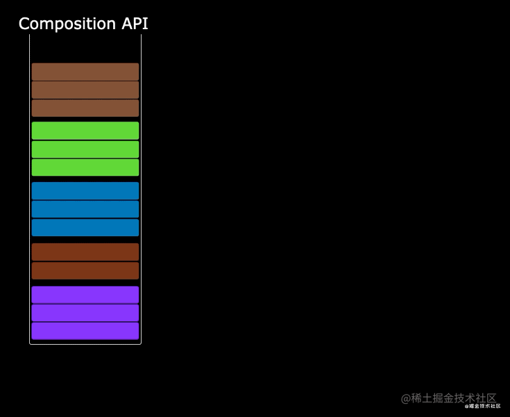

# frontend-vue-learning

[TOC]

【Vue2+Vue3】

https://www.bilibili.com/video/BV1Zy4y1K7SH/?p=168&spm_id_from=pageDriver&vd_source=b850b3a29a70c8eb888ce7dff776a5d1【完结】

【Vue3】

https://www.bilibili.com/video/BV1Za4y1r7KE/?p=66&spm_id_from=pageDriver&vd_source=b850b3a29a70c8eb888ce7dff776a5d1

【Vue Cli】https://cli.vuejs.org/zh/

【Vue Router】https://router.vuejs.org/zh/

【Vuex】https://vuex.vuejs.org/zh/

# 创建Vue2工程

## 1、安装Vue Cli 5.x

- 前提：

Node.js ^12.0.0 || >= 14.0.0

- 安装：

```shell
$ npm i -g @vue/cli
```

- 升级

如需升级全局的Vue Cli包，请原型。

```shell
$ npm update -g @vue/cli
```

- 创建项目

```shell
$ vue create vue_test
```

- 启动项目

```shell
$ cd vue_test
$ npm run serve
```

- 查看配置

```shell
$ vue inspect > output.js
```

## 2、一个Vue2的一个实战项目

【尚品汇】https://www.bilibili.com/video/BV1Vf4y1T7bw/?p=200&spm_id_from=pageDriver&vd_source=b850b3a29a70c8eb888ce7dff776a5d1 【完结】

- 订单支付页面需要用有收货地址的账号（13700000000/111111）
- 前端UI框架
  - React系列
    - PC端
      - Ant Design https://ant.design/index-cn
    - Mobile端
      - Ant Design Mobile https://mobile.ant.design/zh
  - Vue系列
    - PC端
      - ElementUI https://element.eleme.cn/#/zh-CN/
      - Element Plus https://element-plus.org/zh-CN/#/zh-CN
      - MorJS https://mor.eleme.cn/guides/introduction/getting-started/
    - Mobile端
      - Ant Design Vue https://www.antdv.com/docs/vue/introduce-cn/
      - Vant

## 3、小贴士

- 地址栏中，经常出现#，是什么作用，能不能去掉#？
- hash模式：地址栏包含#符号，#以后的不被后台获取
- history模式：具有对url历史记录进行修改的功能
- 在微信支付、分享url作为参数传递时，#不能满足需求
- history需要后台配置，处理404的问题。


【谷粒商城】

https://www.bilibili.com/video/BV1zB4y1K7by?p=37&vd_source=b850b3a29a70c8eb888ce7dff776a5d1

【ECharts官网】https://echarts.apache.org/zh/index.html

【MDN官网】https://developer.mozilla.org/zh-CN/

【Vue2中文官网】https://v2.cn.vuejs.org/v2/guide/

【Vue2脚手架】https://cli.vuejs.org/zh/

组件通信方式：

- props
  - 适用于的场景：父子组件通信
  - 注意事项：
    - 如果父组件给子组件传递函数：本质其实是子组件给父组件传递数据。
    - 如果父组件给子组件传递数据：本质就是父组件给子组件传递数据。
  - 书写方式：
    - ["todo"]
    - {type:Array}
    - {type:Array,default:[]}
  - 小提示：路由的props，书写形式：布尔值、对象、函数形式
- 自定义事件
  - 适用场景：子组件给父组件传递数据
  - $on与$emit
- 全局事件总线$bus
  - 适用场景：万能的
  - Vue.prototype.$bus = this;
- pubsub-js，在React框架中使用较多（发布与订阅）
  - 适用场景：万能的
- Vuex
  - 适用场景：万能的
- ref：父组件获取子组件VC，获取子组件的响应式数据以及方法。
- 插槽-slot
  - 适用场景：父子组件通信......（一般是结构）
  - 默认插槽
  - 具名插槽
  - 作用域插槽
- $refs、$children、$parent
- $attrs、$listeners


# Vue3


【Vue3中文官网】https://cn.vuejs.org/guide/introduction.html

Vue2迁移到Vue3的非兼容性改变：https://v3-migration.vuejs.org/zh/breaking-changes/

## 1.Vue3简介

- 2020年9月18日，`Vue.js`发布版`3.0`版本，代号：`One Piece`（n
- 经历了：[4800+次提交](https://github.com/vuejs/core/commits/main)、[40+个RFC](https://github.com/vuejs/rfcs/tree/master/active-rfcs)、[600+次PR](https://github.com/vuejs/vue-next/pulls?q=is%3Apr+is%3Amerged+-author%3Aapp%2Fdependabot-preview+)、[300+贡献者](https://github.com/vuejs/core/graphs/contributors)
- 官方发版地址：[Release v3.0.0 One Piece · vuejs/core](https://github.com/vuejs/core/releases/tag/v3.0.0)
- 截止2023年10月，最新的公开版本为：`3.3.4`

```bash
$ npm view vue versions
```


## 2.Vue3带来了什么

### 1.性能的提升

- 打包大小减少41%

- 初次渲染快55%, 更新渲染快133%

- 内存减少54%

  ......

### 2.源码的升级

- 使用Proxy代替defineProperty实现响应式

- 重写虚拟DOM的实现和Tree-Shaking

  ......

### 3.拥抱TypeScript

- Vue3可以更好的支持TypeScript

### 4.新的特性

1. Composition API（组合API）

   - setup配置
   - ref与reactive
   - watch与watchEffect
   - provide与inject
   - ......
2. 新的内置组件
   - Fragment 
   - Teleport
   - Suspense
3. 其他改变

   - 新的生命周期钩子
   - data 选项应始终被声明为一个函数
   - 移除keyCode支持作为 v-on 的修饰符
   - ......

## 3、创建Vue3工程

### 3.1、使用Vue Cli创建

官方文档：https://cli.vuejs.org/zh/guide/creating-a-project.html#vue-create

> 备注：目前`vue-cli`已处于维护模式，官方推荐基于 `Vite` 创建项目。

```bash
## 查看@vue/cli版本，确保@vue/cli版本在4.5.0以上
vue --version # 或者vue -V
## 安装或者升级你的@vue/cli
npm i -g @vue/cli
## 创建
vue create vue3_test

##  随后选择3.x
##  Choose a version of Vue.js that you want to start the project with (Use arrow keys)
##  > 3.x
##    2.x

## 启动
cd vue3_test
npm run serve
```

### 3.2、使用Vite创建（推荐）

官方文档：https://vitejs.cn/

- 什么是vite？—— 新一代前端构建工具。
- 优势如下：
  - 开发环境中，无需打包操作，可快速的冷启动。
  - 轻量快速的热重载（HMR），能实现极速的服务启动。
  - 对 `TypeScript`、`JSX`、`CSS` 等支持开箱即用
  - 真正的按需编译，不再等待整个应用编译完成。
  
- 传统构建（Webpack）与Vite构建对比图


- 具体操作如下（点击查看[官方文档](https://cn.vuejs.org/guide/quick-start.html#creating-a-vue-application)）

> 前提条件
>
> - 熟悉命令行
> - 已安装 18.0 或更高版本的 [Node.js](https://nodejs.org/)

- 简单快速版

```bash
## 创建工程
npm init vite-app vue3_test_vite
## 进入工程目录
cd vue3_test_vite
## 安装依赖
npm install
## 运行
npm run dev
```

- 很多选项版【推荐】

```bash
$ npm create vue@latest

Vue.js - The Progressive JavaScript Framework

√ 请输入项目名称： ... vue3_test_vite
√ 是否使用 TypeScript 语法？ ... 否 / 是
√ 是否启用 JSX 支持？ ... 否 / 是
√ 是否引入 Vue Router 进行单页面应用开发？ ... 否 / 是
√ 是否引入 Pinia 用于状态管理？ ... 否 / 是
√ 是否引入 Vitest 用于单元测试？ ... 否 / 是
√ 是否要引入一款端到端（End to End）测试工具？ » 不需要
√ 是否引入 ESLint 用于代码质量检测？ ... 否 / 是

正在构建项目 C:\Job\JobResource\WebProjects\frontend-vue-learning\vue3-02-advanced\vue3_test_vite...

项目构建完成，可执行以下命令：

  cd vue3_test_vite
  npm install
  npm run dev
```


## 4、Vue2 VS Vue3生命周期

【Vue2生命周期图示】https://v2.cn.vuejs.org/v2/guide/instance.html#%E7%94%9F%E5%91%BD%E5%91%A8%E6%9C%9F%E5%9B%BE%E7%A4%BA

【Vue3生命周期图示】https://cn.vuejs.org/guide/essentials/lifecycle.html


<div style="width:450px;height:740px;overflow-y: scroll;float:left;">
	
</div>
<div style="width:450px;height:720px;overflow:hidden;float:right;margin-top:20px;">
	
</div>


## 5、Composition API的优势

### 5.1、Options API存在的问题

传统的Options API中，新增或者修改一个需求，就需要分别在data、methods、computed、watch里修改。

<div style="width:600px;height:370px;overflow:hidden;float:left">
    <!---->
    
</div>
<div style="width:300px;height:370px;overflow:hidden;float:left">
    <!---->
    
</div>


### 5.2、Composition API 的优势

我们可以更加优雅的组织我们的代码，函数。让相关功能的代码更加有序的组织在一起。

<div style="width:500px;height:340px;overflow:hidden;float:left">
    <!---->
    
</div>
<div style="width:430px;height:340px;overflow:hidden;float:left">
    <!---->
    
</div>


## 6、新的组件

### 6.1、Fragment

- Vue2中：组件必须有一个根标签。
- 在Vue3中组件可以没有根标签，内部会将多个标签包含在一个Fragment虚拟元素中。
- 好处：减少标签层级，减小内存占用。

### 6.2、其他的改变

- data选项应始终被声明为一个函数。

- 过度类名的更改：

  - Vue2.x写法

    ```css
    .v-enter,
    .v-leave-to {
      opacity: 0;
    }
    .v-leave,
    .v-enter-to {
      opacity: 1;
    }
    ```

  - Vue3.x写法

    ```css
    .v-enter-from,
    .v-leave-to {
      opacity: 0;
    }
    
    .v-leave-from,
    .v-enter-to {
      opacity: 1;
    }
    ```

- <strong style="color:#DD5145">移除</strong>keyCode作为 v-on 的修饰符，同时也不再支持```config.keyCodes```

- <strong style="color:#DD5145">移除</strong>```v-on.native```修饰符

  - 父组件中绑定事件

    ```vue
    <my-component
      v-on:close="handleComponentEvent"
      v-on:click="handleNativeClickEvent"
    />
    ```

  - 子组件中声明自定义事件

    ```vue
    <script>
      export default {
        emits: ['close']
      }
    </script>
    ```

- <strong style="color:#DD5145">移除</strong>过滤器（filter）

  > 过滤器虽然这看起来很方便，但它需要一个自定义语法，打破大括号内表达式是 “只是 JavaScript” 的假设，这不仅有学习成本，而且有实现成本！建议用方法调用或计算属性去替换过滤器。

- <span style="color:red;font-weight:bold;">v-model</span>指令在组件上的使用已经被重新设计，替换掉了<span style="color:red;font-weight:bold;">v-bind.sync</span>。

- <span style="color:red;font-weight:bold;">v-if和v-for</span>在同一个元素身上使用时的优先级发生了变化。Vue2是v-for优先，Vue3总是v-if优先。

- 移除了<span style="color:red;font-weight:bold;">$on、$off和$once实例方法</span>。

- 移除了过滤器<span style="color:red;font-weight:bold;">filter</span>。

- 移除了<span style="color:red;font-weight:bold;">$children</span>实例<span style="color:red;font-weight:bold;">propert</span>

- ...更多参考：Vue2迁移到Vue3的非兼容性改变：https://v3-migration.vuejs.org/zh/breaking-changes/

## 7、一个Vue3的实战项目

【aswsomejs】https://awesomejs.dev/

## 8、Pinia（Vuex替代品）

<span style="color:red;font-weight:bold;">集中式状态管理库：</span>

https://pinia.web3doc.top/
