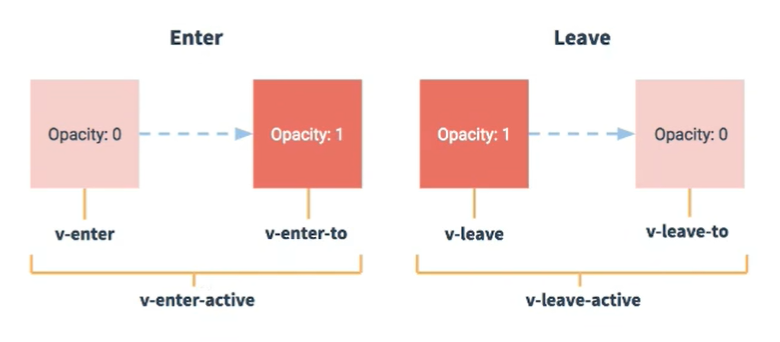
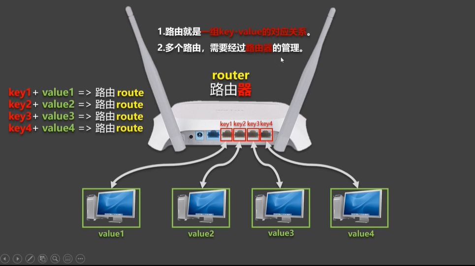

# vue_test

## Project setup
```
npm install
```

### Compiles and hot-reloads for development
```
npm run serve
```

### Compiles and minifies for production
```
npm run build
```

### Lints and fixes files
```
npm run lint
```

### Customize configuration
See [Configuration Reference](https://cli.vuejs.org/config/).


# 笔记

<span style="color:red;font-weight:bold;">建议通过VSCode直接打开“vue2-02-advanced“文件夹。</span>

## 组件

- 传统方式编写应用存在的问题：
  - 依赖关系混乱，不好维护。
  - 代码复用率不高。
- 组件的定义
  - 实现应用中局部功能代码和资源的集合

## 脚手架文件结构

```shell
|-- README.md			应用描述文件
|-- .gitignore			git版本管制忽略的配置
|-- babel.config.js		babael的配置文件
|-- jsconfig.json		
|-- node_modules		包安装目录
|-- package-lock.json	包版本控制文件
|-- package.json		应用宝配置文件
|-- public
|   |-- favicon.ico		页签图标
|   `-- index.html		主页面
|-- src
|   |-- App.vue			汇总所有组件
|   |-- assets			存放静态资源
|   |-- components		存放组件
|   `-- main.js			入口文件
`-- vue.config.js
```


## 关于不同版本的Vue：

- vue.js与vue.runtime.xxx.js的区别：
  - vue.js是完整版的Vue，包含：核心功能+模板解析器。
  - vue.runtime.xxx.js是运行版的Vue，只包含：核心功能；没有模板解析器。
- 因为vueruntime.xxx.js没有模板解析器，所以不能使用template这个配置项，需要使用render函数接收到的 createElement 函数去指定具体内容。


## vue.config.js配置文件

1. 使用 vue inspect > output.js 可以查看到Vue脚手架的默认配置。
2. 使用vue.config.js可以对脚手架进行个性化定制，详情见：https://cli.vuejs.org/zh/config/#lintonsave

## ref属性

1. 被用来给元素或者子组件注册引用信息（id的替代者）

2. 应用在html标签上获取的是真实DOM元素，应用在组件标签上时组件实例对象（vc）

3. 使用方式：

   打标识：`<h1 ref="xxx">......</h1>` 或 `<School ref="xxx"></School>`

   获取：this.$refs.xxx

## 配置项props

- 功能：让组件接收外部传过来的数据

  - 传递数据：

    ```vue
    <Demo name="xxx"/>
    ```

  - 接收数据：

    - 第一种方式（只接收）：

    ```vue
    props: ['name']
    ```

    - 第二种方式（限制类型）：

    ```vue
    props: {
    	name: String
    }
    ```

    - 第三种方式（限制类型、限制必要性、指定默认值）：

    ```shell
    props: {
    	name: {
    		type: String, // 类型
    		required: true, // 必要性
    		default: '老王' // 默认值
    	}
    }
    ```

- 备注：props是只读的，Vue底层会检测你对props的修改，如果进行了修改，就会发出警告，若业务需求确实需要修改，那么请复制props的内容到data中一份，然后去修改data中的数据。

## mixin（混入）

- 功能：可以把多个组件共用的配置提取成一个混入对象。

- 使用方式：

  - 第一步：定义混入，例如：

    ```vue
    {
    	data(){......},
    	methods:{......},
    	......
    }
    ```

  - 第二步：使用混入，例如：

    - 全局混入：Vue.mixin(xxx)
    - 局部混入：mixins: ['xxx']


## 插件

- 功能：用于增强Vue

- 本质：包含install方法的一个对象，install的第一个参数是Vue，第二个以后的参数是插件使用者传递的数据。

- 定义插件：

  ```vue
  对象.install = function(Vue, options) {
  	// 1.添加全局过滤器
  	Vue.filter(......)
  	// 2.添加全局指令
  	Vue.directive(......)
  	// 3.配合全局混入（合）
  	Vue.mixin(......)
  	// 4.添加实例方法
  	Vue.prototype.$myMethod = function(){......}
  	Vue.prototype.$myProperty = xxx
  }
  ```

- 使用插件：Vue.use(xxx);


## scoped样式

- 作用：让样式在局部生效，防止冲突。

- 写法：

  <style scoped>

## 总结TodoList案例

- 组件化编码流程：
  - 拆分静态组件：组件要按照功能点拆分，命名不要与html元素冲突。
  - 实现动态组件：考虑好数据的存放位置，数据是一个组件在用，还是一些组件在用：
    - 一个组件在用：放在组件自身即可。
    - 一些组件在用：放在他们共同的父组件上（<span style="color:red">状态提升</span>）
  - 实现交互：从绑定事件开始。
- props适用于：
  - 父组件==>子组件通信。
  - 子组件==>父组件通信（要求父先给子一个函数）
- 使用v-model时要切记：v-model绑定的值不能是props传过来的值，因为props是不可以修改的！
- props穿过来的若是对象类型的值，修改对象中的属性时Vue不会报错，但不推荐这样做。


## webStorage

- 存储内容大小一般支持5MB左右（不同浏览器可能还不一样）
- 浏览器端通过window.sessionStorage和window.localStorage属性来实现本地存储机制。
- 相关API：
  - xxxStorage.setItem('key', 'value');
    - 该方法接受一个键和值作为参数，会把键值对添加到存储中，如果键名存在，则更新其对应的值。
  - xxxStorage.getItem('person');
    - 该方法接受一个键名作为参数，返回键名对应的值。
  - xxxStorage.removeItem('key')
    - 该方法接受一个键名作为参数，并把该键名从存储中删除。
  - xxxStorage.clear()
    - 该方法会清空存储中的所有数据。
- 备注：
  - sessionStorage存储的内容会随着浏览器窗口关闭而消失。
  - localStorage存储的内容，需要手动清除才会消失。
  - xxxStorage.getItem(xxx)，如果xxx对应的value获取不到，那么getItem的返回值是null。
  - JSON.parse(null)的结果依然是null.


## 组件的自定义事件

- 一种组件间通信的方式，适用于<span style="color:red;font-weight:bold;">子组件==>父组件</span>

- 使用场景：A是父组件，B是子组件，B想给A传数据，那么就要在A中给B绑定自定义事件（<span style="color:red;font-weight:bold;">事件的回调在A中</span>）。

- 绑定自定义事件：

  - 第一种方式，在父组件中：

    ```vue
    <Demo @atguigu="test"/> 
    // 或者
    <Demo v-on:atguigu="test"/>
    ```

  - 第二种方式，在父组件中：

    ```vue
    <Demo ref="demo"/>
    ......
    mounted() {
    	this.$refs.xxx.$on('atguigu', this.test);
    }
    ```

  - 若想让自定义事件只能触发一次，可以使用`once`修饰符，或`$once`方法。

- 触发自定义事件：`this.$emit('atguigu',数据)`。

- 解绑自定义事件：`this.$off('atguigu')`。

- 组件上也可以绑定原生DOM事件，需要使用`native`修饰符。

- 注意：通过`this.$refs.xxx.$on('atguigu',回调)`绑定自定义事件时，回调<span style="color:red;font-weight:bold;">要么配置在methods中，要么用箭头函数</span>，否则this指向会出问题！！！


## 全局事件总线（GlobalEventBus）

- 一种组件间通信的方式，适用于<span style="color:red;font-weight:bold;">任意组件间通信</span>。

- 安装全局事件总线：

  ```js
  new Vue({
  	......
      beforeCreate() {
  		Vue.prototype.$bus = this; // 安装全局事件总线，￥bus就是当前应用的vm
  	},
      ......
  })
  ```

- 使用全局事件总线：

  - 接收数据：A组件想接收数据，则在A组件中给$bus绑定自定义事件<span style="color:red;font-weight:bold;">回调留在A组件自身</span>。

    ```js
    methods(){
        demo(data){......}
    }
    ......
    mounted(){
        this.$bus.$on('xxx', this.dmeo);
    }
    ```

  - 提供数据：`this.$but.$emit('xxx', 数据)`

- 最好在beforeDestroy钩子中，用$off去解绑<span style="color:red;font-weight:bold;">当前组件所用到的</span>事件。


## 消息订阅与发布

- 一种组件间通信的方式，适用于<span style="color:red;font-weight:bold;">任意组件间通信</span>。

- 使用步骤：

  - 安装pubsub：`npm i pubsub-js`

  - 引入：`import pubsub from 'pubsub-js'`

  - 接收数据：A组件想接收数据，则在A组件中订阅消息，订阅的<span style="color:red;font-weight:bold;">回调留在A组件自身</span>。

    ```js
    methods(){
        demo(data){......}
    }
    ......
    mounted(){
        this.pid = pubsub.subscribe('xxx', this.demo); // 订阅消息
    }
    ```

  - 提供数据：`pubsub.subscribe('xxx', 数据);`

  - 最好在beforeDestroy钩子中，用`pubsub.unsubscribe(this.pid)`去<span style="color:red;font-weight:bold;">取消订阅</span>。

## nextTick

- 语法：`this.$nextTick(回调函数)`
- 作用：在下一次DOM更新结束后执行其指定的回调。
- 什么时候用：当改变数据后，要基于更新后的新DOM进行某些操作时，要在nextTick所指定的回调函数中执行。


## Vue封装的过度与动画

- 作用：在插入、更新或移除DOM元素时，在合适的时候给元素添加样式类名。
- 图示：



- 写法：

  - 准备好样式：

    - 元素进入的样式：
      1. v-enter：进入的起点
      2. v-enter-active：进入过程中
      3. v-enter-to：进入的终点
    - 元素离开的样式：
      1. v-leave：离开的起点
      2. v-leave-active：离开过程中
      3. v-leave-to：离开的重点

  - 使用`<transition>`包裹要过度的元素，并配置name属性：

    ```vue
    <transition name="hello">
    	<h1 v-show="isShow">
            你好啊！
        </h1>
    </transition>
    ```

  - 备注：若有多个元素需要过度，则需要使用：`<transition-group>`，且每个元素都要指定`key`值。

- 利用三方动画库

  - https://animate.style/

  - 安装

    ```shell
    npm i animate.css
    ```

  - 引入

    ```js
    import "animate.css";
    ```

  - 示例

    ```vue
    <transition-group
      name="animate__animated animate__bounce"
      appear
      enter-active-class="animate__swing"
      leave-active-class="animate__backOutUp"
    >
      <h1 v-show="isShow" key="1">你好啊！</h1>
      <h1 v-show="!isShow" key="2">尚硅谷！</h1>
    </transition-group>
    ```


## Vue脚手架配置代理

本示例用到的后端服务是`test_proxy_server`，执行`node server1`和`node server2`即可。

- 方法一

  - 在vue.config.js中添加如下配置：

  ```js
  // 开启代理服务器（方式一）
  devServer: {
      proxy: 'http://localhost:5000'
  },
  ```

  - 说明：
    - 优点：配置简单，请求资源时直接发给前端（8080）即可。
    - 缺点：不能配置多个代理，不能灵活的控制请求是否走代理。
    - 工作方式：若按照上述配置代理，当请求了前端不存在的资源时，那么该请求会转发给服务器（优先匹配前端资源）。

- 方法二

  - 编写vue.config.js配置具体代理规则

    ```js
    // 开启代理服务器（方式二）
    devServer: {
        proxy: {
          '/api': {
            target: 'http://localhost:5000', // 代理目标的基础路径
            pathRewrite: { '^/api': '' }
            // ws: true, // 用于支持websocket
            // changeOrigin: true // 用于控制请求头中的host值
          },
          '/demo': {
            target: 'http://localhost:5001', // 代理目标的基础路径
            pathRewrite: { '^/demo': '' }
            // ws: true, // 用于支持websocket
            // changeOrigin: true // 用于控制请求头中的host值
          },
        }
    }
    ```

  - 说明：

    - 优点：可以配置多个代理，且可以灵活的控制请求是否走代理。
    - 缺点：配置略微繁琐，请求资源时必须加前缀。

## 插槽

- 作用：让父组件可以向子组件指定位置插入html结构，也是一种组件间通信的方式，适用于<span style="color:red;font-weight:bold;">父组件==>子组件</span>

- 分类：默认插槽、具名插槽、作用域插

- 使用方式：

  1. 默认插槽：

     ```vue
     父组件中：
     <Category>
     	<div>
             html结构1
         </div>
     </Category>
     子组件中：
     <template>
     	<div>
             <!-- 定义插槽 -->
             <slot>插槽默认内容......</slot>
         </div>
     </template>
     ```

  2. 具名插槽

     ```vue
     父组件中：
     <Category>
     	<template slot="center">
         	<div>
                 html结构1
             </div>
         </template>
     	<template v-slot:footer>
         	<div>
                 html结构2
             </div>
         </template>
     </Category>
     子组件中：
     <template>
     	<div>
             <!-- 定义插槽 -->
             <slot name="center">插槽默认内容......</slot>
             <slot name="footer">插槽默认内容......</slot>
         </div>
     </template>
     ```

  3. 作用域插槽：

     1. 理解：<span style="color:red;font-weight:bold;">数据在组件的自身上，但根据数据生成的结构需要组件的使用者来决定。</span>（games数据在Category组件中，但使用数据所遍历出来的结构由App组件决定）

     2. 具体编码：

        ```vue
        父组件中：
        <Category>
            <template scope="scopeData">
            	<!-- 生成的是ul列表 -->
        		<ul>
        			<li v-for="(item, idx) in scopeData.games" :key="idx">
                    	{{ item }}
                	</li>
                </ul>
            </template>
            <template slot-scope="scopeData">
            	<!-- 生成的是h4标题 -->
                <h4 v-for="(item, idx) in scopeData.games" :key="idx">
                    {{ item }}
                </h4>
            </template>
        </Category>
        子组件中：
        <template>
        	<div>
                <slot :games="games"></slot>
            </div>
        </template>
        <script>
        	export default {
                name: 'Category',
                props: ['title'],
                // 数据在子组件自身
                data() {
                    return {
                        games: ["红色警戒", "穿越火线", "劲舞团", "超级玛丽"],
                    }
                }
            }
        </script>
        ```


## Vuex

### Vuex是什么？

1. 概念：专门在Vue中实现集中式状态（数据）管理的一个Vue插件，对Vue应用中多个组件的共享状态进行集中式的管理（读/写），也是一种组件间通信的方式，且适用于任意组件间通信。
2. Github地址： https://github.com/vuejs/vuex

- 安装

```shell
npm i vuex@3
```

### 什么时候使用Vuex

1. 多个组件依赖于同一状态
2. 来自不同组件的行为需要变更同一状态

### 搭建Vuex环境

1. 创建文件：`src/store/index.js`

```js
// 该文件用于创建Vuex中最为核心的store

// 引入Vue
import Vue from 'vue'
// 引入Vuex
import Vuex from 'vuex'
// 使用插件
Vue.use(Vuex)

// 准备actions——用于响应组件中的动作
const actions = {}
// 准备mutations——用于操作数据(state)
const mutations = {}
// 准备state——用于存储数据
const state = {}

// 创建并暴露store
export default new Vuex.Store({
  actions: actions,
  mutations,
  state,
});
```

2. 在`main.js`中创建vm时传入`store`配置项

````js
......
// 引入store
import store from './store'
......

// 创建vm
new Vue({
    el: '#app',
    render: h=> h(App),
    store
})
````

### 基本使用

1. 初始化数据`state`、配置`actions`、配置`mutations`、操作文件`store.js`

```js
// 该文件用于创建Vuex中最为核心的store

// 引入Vue
import Vue from 'vue'
// 引入Vuex
import Vuex from 'vuex'
// 使用插件
Vue.use(Vuex)

// 准备actions——用于响应组件中的动作
const actions = {
  jia: function (context, value) {
    console.log('actions->jia被调用了');
    context.commit('JIA', value);
  },
}
// 准备mutations——用于操作数据(state)
const mutations = {
  JIA: function (mutations, value) {
    console.log('actions->JIA被调用了');
    state.sum += value;
  }
}
// 准备state——用于存储数据
const state = {
  sum: 0, // 当前的和
}

// 创建并暴露store
export default new Vuex.Store({
  actions: actions,
  mutations,
  state,
});
```

2. 组件中读取Vuex中的数据：`$store.state.sum`
3. 组件中修改Vuex中的数据：`$store.dispatch('action中的方法名', 数据)`或者`$store.commit('mutations中的方法名','数据')`

> 备注：若没有网络请求或其他业务逻辑，组件中也可以越过actions，即不写`dispatch`，直接编写`commit`。

### getters的使用

1. 概念：当state中的数据需要经过加工后再使用时，可以使用getters加工。
2. 在`store.js`中追加`getters`配置

```js
......
const getters = {
    bigSum(state) {
        return state.sum * 10;
    }
}
// 创建并暴露store
export default new Vuex.Store({
    ......,
    getters
})
```

3. 组件中读取数据：`$store.getters.bigSum`

### 四个map方法的使用

1. mapState方法：用于帮助我们映射`state`中的数据为计算属性。

```js
computed: {
    // 借助mapState生成计算属性，从state中读取数据。（对象写法）
    ...mapState({ sum: "sum", school: "school", subject: "subject" }),
    // 借助mapState生成计算属性，从state中读取数据。（数组写法）
	...mapState(["sum", "school", "subject"]),
}
```

2. mapGetters方法：用于帮助我们映射`getters`中的数据为计算属性

```js
computed: {
    // 借助mapGetters生成计算属性，从getters中读取数据。（对象写法）
    ...mapGetters({ bigSum: "bigSum" }),
    // 借助mapGetters生成计算属性，从getters中读取数据。（数组写法）
    ...mapGetters(["bigSum"]),
}
```

3. mapActions方法：用于帮助我们生成与`actions`对话的方法，即：包含`$store.dispatch(xxx)`的函数

```js
methods: {
    // 借助mapActions生成对应的方法，方法中会调用dispatch方法去联系actions。（对象写法）
    ...mapActions({ incrementOdd: "jiaOdd", incrementWait: "jiaWait" }),
	// 借助mapActions生成对应的方法，方法中会调用dispatch方法去联系actions。（数组写法）
    ...mapActions(["jiaOdd", "jiaWait"]),
}
```

4. mapMutations方法：用于帮助我们生成与`mutatioins`对话的方法，即：包含`$store.commit(xxx)`的函数

```js
methods: {
    // 借助mapMutations生成对应的方法，方法中会调用commit方法去联系mutations。（对象写法）
    ...mapMutations({ increment: "JIA", decrement: "JIAN" }),
    // 借助mapMutations生成对应的方法，方法中会调用commit方法去联系mutations。（数组写法）
    ...mapMutations(["JIA", "JIAN"]),
}
```

> 备注：mapActions与mapMutations使用时，若需要传递参数需要：在模板中绑定事件时传递参数，否则参数是事件对象。

### 模块化+命名空间

1. 目的：让代码更好维护，让多种数据分类更加明确。
2. 修改`store.js`

```js
const countAbout = {
    namespaced: true, // 开启命名空间
    state: {},
    mutations: {},
    actions: {},
    getters: {}
}
              
const personAbout = {
    namespaced: true, // 开启命名空间
    state: {},
    mutations: {},
    actions: {},
    getters: {}              
}

const store = new Vuex.Store({
	modules: {
		countAbout: countAbout,
		personAbout
	}
})
```

3. 开启命名空间后，组件中读取state数据：

```javascript
// 方式一：自己直接读取
this.$store.state.personAbout.list
// 方式二：借助mapState读取
...mapState('countAbout', ['sum', 'school', 'subject'])
```

4. 开启命名空间后，组件中读取getters数据：

```js
// 方式一：自己直接读取
this.$store.getters['personAbout/firstPersonName']
// 方式二：借助mapGetters读取
...mapGetters('countAbout', ['bigSum'])
```

5. 开启命名空间后，组件中调用dispatch

```js
// 方式一：自己直接dispatch
this.$store.dispatch('personAbout/addPersonWang', person)
// 方式二：借助mapActions
...mapActions('countAbout', {incrementOdd:'jiaOdd', incrementWait:'jiaWait'})
```

6. 开启命名空间后，组件中调用commit

```js
// 方式一：自己直接commit
this.$store.commit('personAbout/ADD_PERSON', person)
// 方式二：
...mapMutations('countAbout', {increment:'JIA', decrement: 'JIAN'})
```


## VueRouter

### 相关理解

#### vue-router的理解

Vue的一个插件库，专门用来实现SPA应用。



#### 对SPA应用的理解

1. 单页Web应用（single page web application，SPA）。
2. 整个应用只有<span style="color:red;font-weight:bold;">一个完整的页面</span>。
3. 点击页面中的导航链接<span style="color:red;font-weight:bold;">不会刷新</span>页面，只会做页面的<span style="color:red;font-weight:bold;">局部更新</span>。
4. 数据需要通过ajax请求获取。

- 安装

```js
npm i vue-router@3
```

#### 路由的理解

- 什么是路由？
  - 一个路由就是一组映射关系（key-value）
  - key为路径，value可能是function或component
- 路由分类
  - 后端路由：
    - 理解：value是functioin，用于处理客户端提交的请求。
    - 工作过程：服务器接收到一个请求时，根据**请求路径**找到匹配的**函数**来处理请求，返回响应数据。
  - 前端路由：
    - 理解：value是component，用于展示页面内容。
    - 工作过程：当浏览器的路径改变时，对应的组件就会显示。

### 基本路由

#### 路由：

1. 理解：一个路由（route）就是一组映射关系（key-value），多个路由需要路由器（router）进行管理。
2. 前端路由：key是路径，value是组件。

#### 1.基本使用

1. 安装vue-router，命令：`npm i vue-router`

2. 应用插件：`Vue.use(VueRouter)`
3. 编写router配置项：

```js
// 该文件专门用于创建整个应用的路由器

// 引入Vue
import Vue from 'vue'
// 引入VueRouter
import VueRouter from "vue-router";
// 使用插件
Vue.use(VueRouter)

// 引入组件
import About from '../components/About.vue'
import Home from '../components/Home.vue'

// 创建一个路由器
export default new VueRouter({
  routes: [
    {
      path: '/about',
      component: About
    },
    {
      path: '/home',
      component: Home
    }
  ]
})
```

4. 实现切换(active-class可配置高亮样式）

```html
<router-link class="list-group-item" active-class="active" to="/about">About</router-link>
```

5. 指定展示位置

```html
<router-view></router-view>
```

#### 2.几个注意点

1. 路由组件通常存放在`pages`文件夹，一般组件通常存放在`components`文件夹。
2. 通过切换，“隐藏”了的路由组件，默认是被销毁的，需要的时候再去挂载。
3. 每个组件都有自己的`$route`属性，里面存储着自己的路由信息。
4. 整个应用只有一个router，可以通过组件的`$router`属性获取到。

#### 3.嵌套路由

1. 配置路由规则，使用children：

```js
export default new VueRouter({
  routes: [
    {
      path: '/about',
      component: About
    },
    {
      path: '/home',
      component: Home,
      children: [ // 通过children配置子级路由
        {
          path: 'news', // 此处一定不要写 /news
          component: News
        },
        {
          path: 'message', // 此处一定不要写 /message
          component: Message
        }
      ]
    }
  ]
})
```

#### 4.路由的query参数

1. 传递参数

```js
<!-- 跳转路由并携带query参数，to的字符串写法 -->
<!-- <router-link
  :to="`/home/message/detail?id=${item.id}&title=${item.title}`"
>
  {{ item.title }}
</router-link> -->

<!-- 跳转路由并携带query参数，to的对象写法【推荐】 -->
<router-link
  :to="{
    path: '/home/message/detail',
    query: {
      id: item.id,
      title: item.title,
    },
  }"
>
  {{ item.title }}
</router-link>
```

2. 接收参数

```js
$route.query.id
$route.query.title
```

#### 5.命名路由

1. 作用：可以简化路由的跳转。

2. 如何使用

   1. 给路由命名

   ```json
   {
       path: '/demo',
       component: Demo,
       children: [
           {
               path: 'test',
               component: Test,
               children: [
                   {
                       name: 'hello', // 给路由命名
                       path: 'welcome',
                       component: Hello,
                   }
               ]
           }
       ]
   }
   ```

   2. 简化跳转

   ```html
   <!-- 简化钱，需要写完整的路径 -->
   <router-link to="/demo/test/welcome">跳转</router-link>
   
   <!-- 简化后，直接通过名字调整 -->
   <router-link :to="{name: 'hello'}">跳转</router-link>
   ```


#### 6.路由的params参数

1. 配置路由，声明接收params参数

```json
{
  path: '/home',
  component: Home,
  children: [ // 通过children配置子级路由
    {
      path: 'news', // 此处一定不要写 /news
      component: News
    },
    {
      path: 'message', // 此处一定不要写 /message
      component: Message,
      children: [
        {
          name: 'xiangqing',
          path: 'detail/:id/:title',
          component: Detail
        },
      ]
    }
  ]
}
```

2. 传递参数

```html
<!-- 跳转路由并携带params参数，to的字符串写法 -->
<router-link :to="`/home/message/detail/${item.id}/${item.title}`">
  {{ item.title }}
</router-link>

<!-- 跳转路由并携带params参数，to的对象写法【推荐】 -->
<router-link
  :to="{
    name: 'xiangqing', // 使用params是无法使用path参数
    params: {
      id: item.id,
      title: item.title,
    },
  }"
>
  {{ item.title }}
</router-link>
```

> 特别注意：路由携带params参数时，若使用to的对象写法，则不能使用path配置项，必须使用name配置！

3. 接收参数

```js
$route.params.id
$route.params.title
```

#### 7.路由的props配置

> 作用：让路由组件更方便的收到参数

```json
{
  name: 'xiangqing',
  path: 'detail/:id/:title',
  component: Detail,
  // props的第一种写法，值为对象，该对象中的所有key-value都会以props的形式传递给Detail组件
  // props: { a: 1, b: 'hello' }
  // props的第二种写法，值为布尔值，若布尔值为真，就会把该路由组件收到的所有params参数，以props的形式传递给Detail组件
  props: true,
  // 第三种写法，props值为函数，该函数返回的对象中每一组key-value都会通过props传给Detail组件
  props($route) {
    return {
      id: $route.params.id,
      title: $route.params.title
    }
  }
},
```

#### 8.`<router-link>`的replace属性

1. 作用：控制路由跳转时操作浏览器历史记录的模式
2. 浏览器的历史记录有两种写入方式：分别为`push`和`replace`，`push`是追加历史记录，`replace`是替换当前记录。路由跳转时默认为`push`
3. 如何开启`replace`模式：`<router-link replace ......>News</router-link>`

#### 9.编程式路由导航

1. 作用：不借助`<router-link>`实现路由跳转，让路由跳转更加灵活。
2. 具体编码：

```js
// $router的两个API
this.$router.push({
    name: "xiangqing", // 使用params是无法使用path参数
    params: {
        id: item.id,
        title: item.title,
    },
});

this.$router.replace({
    name: "xiangqing", // 使用params是无法使用path参数
    params: {
        id: item.id,
        title: item.title,
    },
});

this.$router.back(); // 后退
this.$router.forward(); // 前进
this.$router.go(-2); // 可前进，可后退
```

#### 10.缓存路由组件

1. 作用：让不展示的路由组件保持挂载，不被销毁。
2. 具体编码

```vue
<keep-alive include="News">
	<router-view></router-view>
</keep-alive>
```

> include="News"中的News是组件的name；当不写include时所有的渲染到router-view的组件都被缓存。

#### 11.两个新的生命周期钩子

1. 作用：路由组件所独有的两个钩子，用于捕获路由组件的激活状态。
2. 具体名字：
   1. `actived`路由组件被激活时触发。
   2. `deactived`路由组件失活时触发。

#### 12. 路由守卫

1. 作用；对路由进行权限控制
2. 分类：全局守卫、独享守卫、组件内守卫。
3. 全局守卫：

```js
// 全局前置路由守卫——初始化的时候被调用、每次路由切换之前被调用
router.beforeEach((to, from, next) => {
  console.log('前置路由守卫');
  // 判断是否需要鉴权
  if (to.meta.isAuth) {
    if (localStorage.getItem('school') === 'atguigu') {
      next();
    }
    else {
      alert('学校名不对，无权限访问！');
    }
  } else {
    next();
  }
});

// 全局后置路由守卫——初始化的时候被调用、每次路由切换之后被调用
router.afterEach((to, from) => {
  console.log('后置路由守卫');
  document.title = to.meta.title || '尚硅谷系统';
});
```

4. 独享守卫

```js
{
  name: 'xinwen',
  path: 'news', // 此处一定不要写 /news
  component: News,
  meta: {
    isAuth: true, title: '新闻'
  },
  // 独享路由守卫
  beforeEnter(to, from, next) {
    if (to.meta.isAuth) {
      if (localStorage.getItem('school') === 'atguigu') {
        next();
      }
      else {
        alert('学校名不对，无权限访问！');
      }
    }
  }
}
```

5. 组件内路由守卫

```js
// 通过路由规则，进入该组件时被调用
beforeRouteEnter(to, from, next) {
  console.log("About-beforeRouteEnter");
  if (to.meta.isAuth) {
    if (localStorage.getItem("school") === "atguigu") {
      next();
    } else {
      alert("学校名不对，无权限访问！");
    }
  }
},
// 通过路由规则，离开该组件时被调用
beforeRouteLeave(to, from, next) {
  console.log("About-beforeRouteLeave");
  next();
},
```

#### 13. 路由器的两种工作模式

1. 对于一个url来说，什么是hash值？——#及其后面的内容就是hash值。
2. hash值不会包含在HTTP请求中，即：hash值不会带给服务器。
3. hash模式：
   1. 地中中永远带着#号，不美观。
   2. 若以后将地址通过第三方手机app分享，若app校验严格，则地址会被标记为不合法。
   3. 兼容性较好。
4. history模式：
   1. 地址干净，美观。
   2. 兼容性和hassh模式相比略差。
   3. 应用部署上线时需要后端人员支持，解决刷新页面服务端404的问题。


## Vue UI组件库

### 移动端常用UI组件库

1. Vant https://youzan.github.io/vant
2. Cube UI https://didi.github.io/cube-ui
3. Mint UI http://mint-ui.github.io

### PC端常用UI组件库

1. Element UI https://element.eleme.cn
2. IView UI https://www.iviewui.com


​	


